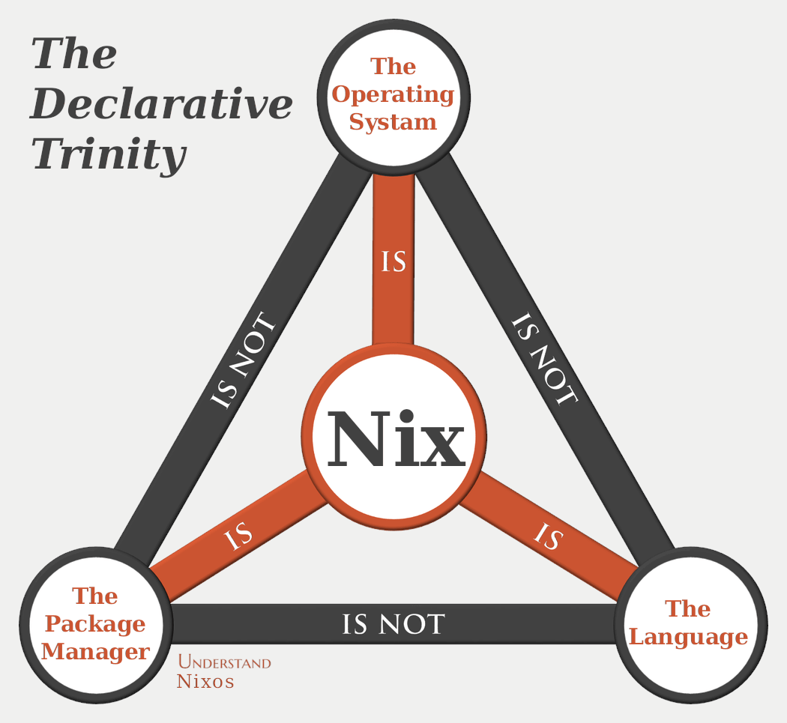

# Introduction to Nix

## Nix, at a glance

* Quick overview of Nix, the package manager: <https://nixos.org/guides/how-nix-works.html>
* Interactive tour of Nix, the language: <https://nixcloud.io/tour/>
* How to deploy NixOS, the operating system: <https://justinas.org/nixos-in-the-cloud-step-by-step-part-1>
* Get up to speed on Flakes, the schema and dependency manager: <https://zero-to-nix.com/>

## More advanced resources

* Nix Pills, the classic A through Z introduction to Nix: <https://nixos.org/guides/nix-pills/>
* NixOS's official and extensive documentation + manuals + guides: <https://nixos.org/learn.html>
* Packaging applications and building NixOS modules: <https://www.youtube.com/@jonringer117>
* A potpourri of good links: <https://github.com/nix-community/awesome-nix>
* QA-style lectures on Nix: <https://www.youtube.com/playlist?list=PLyzwHTVJlRc8yjlx4VR4LU5A5O44og9in>
* "How to learn Nix", a diary of learning nix: <https://ianthehenry.com/posts/how-to-learn-nix/>

## Handy websites to know about

* Search for all available packages and NixOS module options: <https://search.nixos.org/>
* Indexed website of all Nix builtins and of the Nixpkgs library functions: <https://teu5us.github.io/nix-lib.html>
* Overview of the Flake schema: <https://nixos.wiki/wiki/Flakes#Flake_schema>
